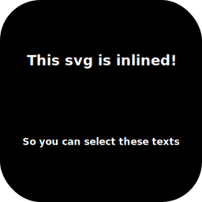
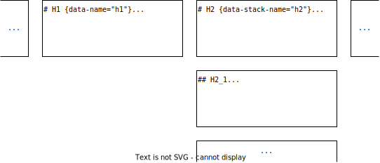

# Intro {data-stack-name="Intro"}

A Simple Easy Converter

<h2>Markdown ➡ Reveal.js</h2>

* Based on Pandoc
* Auto-generated TOC
* Touch-device friendly
* Header footer supported

## Demo

This README.md is converted to revealjs,
see it [here](https://xieby1.github.io/markdown_revealjs/README.html).

## How it works

Bash script + Template file + Pandoc

It's simple and esay!

# Installation {data-stack-name="Install"}

## First

```bash
git clone --recurse-submodules https://github.com/xieby1/markdown_revealjs
```

## Second

[Install latest pandoc](https://github.com/jgm/pandoc).

Note: Ubuntu 22's apt-installed pandoc is too old.

::: {.fragment}
👍That's it!

🎊You've installed markdown_revealjs!
:::

## Third (Optional)

Add revealjs.sh to your PATH env.

```bash
ln -s <path/to>/revealjs.sh /usr/bin/
# or /usr/local/bin/, or ~/.local/bin/
```

# Quick Start {data-stack-name="Quick Start"}

## First Page

Add the metadata (title, author, date)

to top of your markdown file.

These info will become the first page of your slide.

```markdown
% markdown_revealjs !
% xieby1
% 2022.06.24
```

## Basic Syntax

| syntax                           | meaning              |
|----------------------------------|----------------------|
| 1st-level header                 | New horizontal slide |
| 2nd/3rd/4th/5th/6th-level header | New vertical slide   |

## Convert!

```bash
$ revealjs.sh <input.md>
# will generate input.html
```

🐱

It's simple and easy, right?

## daemonize

```bash
$ revealjs.sh -d <input.md>
# will auto refresh browser when input.md is changed
```

# Themes {data-stack-name="Themes"}

Here are predefined themes (template),

just download the source markdown,

and [`revealjs.sh xxx.md`]{style="font-size: 1.5em;"}!

Enjoy the themes below🎉

🔽🔽🔽

## 开芯院

[themes/bosc/index.md](https://github.com/xieby1/markdown_revealjs/blob/main/themes/bosc/index.md)

<iframe src="./themes/bosc/index.html" style="width:800px; height: 450px;"></iframe>

## 龙芯

[themes/loongson/index.md](https://github.com/xieby1/markdown_revealjs/blob/main/themes/loongson/index.md)

<iframe src="./themes/loongson/index.html" style="width:800px; height: 450px;"></iframe>

## 微处理器研究中心

[themes/ict_mtrc_proposal/index.md](https://github.com/xieby1/markdown_revealjs/blob/main/themes/ict_mtrc_proposal/index.md)

<iframe src="./themes/ict_mtrc_proposal/index.html" style="width:800px; height: 450px;"></iframe>

## 国科大计算所答辩

[themes/ucas_ict_thesis/index.md](https://github.com/xieby1/markdown_revealjs/blob/main/themes/ucas_ict_thesis/index.md)

<iframe src="./themes/ucas_ict_thesis/index.html" style="width:800px; height: 450px;"></iframe>

# Advanced Syntax {data-name="Advanced Syntax ..."}

Sorted in alphabet.

# Alignment

All elements

in Reveal.JS

are centered

by default.

😺

## Left Alignment

:::{style="display:inline-block; text-align:left;"}
If you prefer to left align

all children elements.

Add these styles

to the parent element.

😽

```md
:::{style="display:inline-block; text-align:left;"}
things here are all

left aligned

!
:::
```
:::

# Ascii Art with CJK

Auto detect and gracefully handled mono fonts width,

where CJK and Latin characters are mixed

```
┌─────────────┐
│no more ┌────┼────┐
│        │不会│!!!!│
│mismatch│错位│，。│
└────────┼────┘！！│
         └─────────┘
```

# Auto Animate

## Code {data-auto-animate=""}

~~~markdown
```python {data-id="code-animation" data-line-numbers=""}
class Miao:
  def __init__(self):
    pass
```
~~~

```python {data-id="code-animation" data-line-numbers=""}
class Miao:
  def __init__(self):
    pass
```

## Code {data-auto-animate=""}

~~~markdown
```python {data-id="code-animation" data-line-numbers=""}
# This is a class
class Miao:
  # This is a func def
  def __init__(self):
    pass
```
~~~

```python {data-id="code-animation" data-line-numbers=""}
# This is a class
class Miao:
  # This is a func def
  def __init__(self):
    pass
```

# Backgrounds

Did you notice that every page has a default background?

## Default Backgrounds

Set default backgrounds in yml front matter, like

```yml
title-slide-background-image: <URL>
toc-slide-background-image: <URL>
level1-slide-background-image: <URL>
level2-slide-background-image: <URL>
level3-slide-background-image: <URL>
background-size: <CSS background-size>
```

## Per-Slide Backgrounds {data-background-color="LightPink"}

Set per-slide background, like

```markdown
# Per-Slide Backgrounds {data-background-color="LightPink"}
```

More info about background see:

* RevealJS: [backgrounds](https://revealjs.com/backgrounds/)
* Pandoc Extension: [header_attributes](https://pandoc.org/MANUAL.html#extension-header_attributes)


# Fragments

* RevealJS: [fragments](https://revealjs.com/fragments/)

## Multi Lines

::: {.fragment}
* Pandoc Extension: [fenced_divs](https://pandoc.org/MANUAL.html#extension-fenced_divs)
:::
::: {.fragment}
```markdown
::: {.fragment}
Your content here
:::
```
:::

## One Line

* Pandoc Extension: [bracketed_spans](https://pandoc.org/MANUAL.html#extension-bracketed_spans)

[It's in one line!]{.fragment}
[🐱]{.fragment}
[🐶]{.fragment}
[🐹]{.fragment}

:::{.fragment}
```
[It's in one line!]{.fragment}
[🐱]{.fragment}
[🐶]{.fragment}
[🐹]{.fragment}
```
:::

# Headings and slides

Normally, each level of heading will start a new slide.

## Heading not start a new slide

If you want a heading that doesn a new slide, like this

<h3>Level-3 Heading!</h3>

Just use html heading!

```html
<h3>Level-3 Heading!</h3>
```

## Force starting a new slide

If you want to start a new slide without headings.

Just use the markdown horizontal break `---`, like this

---

Force starting a new slide!

# Not Displaying Heading and Chrome

## Not Displaying This Heading {.noheading}

```md
## Not Displaying This Heading {.noheading}
```

## Not Displaying The Chrome in This Slide {.nochrome}

```md
## Not Displaying The Chrome in This Slide {.nochrome}
```

## Not Displaying Both heading and Chrome {.noheading .nochrome}

```md
## Not Displaying Both heading and Chrome {.noheading .nochrome}
```

# Include Files

## include files normally

``` {.include}
./included.md
```

More details: https://github.com/pandoc/lua-filters/blob/master/include-files/include-files.lua

## include files in code block

~~~
``` {include="./helloworld.c"}
```
~~~

``` {.c include="./helloworld.c"}
```

More details: https://github.com/pandoc/lua-filters/blob/master/include-code-files/include-code-files.lua

## example: Chart.js

::: {.container}
:::: {.col}

include a chart.js plot

~~~
``` {.include}
./plots/chartjs.html
```
~~~

::::
:::: {.col}

``` {.include}
./plots/chartjs.html
```

::::
:::

## example: Plotly.py

::: {.container}
:::: {.col}

include a plotly.py plot

~~~
``` {.include}
./plots/plotlypy.html
```
~~~

::::
:::: {.col}

``` {.include}
./plots/plotlypy.html
```

::::
:::

# Inline SVG

```markdown
You can specify width or height, the image will be scaled automatically

{height=500px}
```

{height=500px}

# Label and Link {#label_and_link}

You can label a slide by adding a name to its heading

```md
# Label and Link {#label_and_link}
```

## Link

Then you can go back to the labeled slide ⬆️ [Label and Link](#label_and_link)⬆️ .

```md
[Label and Link](#label_and_link)
```

# Localization (Offline mode)

`markdown_revealjs` can be used completely offline!

## Download this repo

```bash
# download by git
git clone --recurse-submodules https://github.com/xieby1/markdown_revealjs
# or download the source code without .git
wget https://github.com/xieby1/markdown_revealjs/archive/master.tar.gz
tar xzf master.tar.gz
```

## Run revealjs.sh against local repo

Assuming the path to the local repo is `<REPO>`

```bash
REPOROOT=<REPO> <REPO>/bin/revealjs.sh <MD File>
```

Then you can view your slides completely offline!

# Long Table

Bother by long table?

::: {.fragment}
Then use wrap your long table

with [`.longtable`]{style="font-size:1.5em;"} like below

```md
::: {.longtable style="height: 300px;"}
<your long table here>
:::
```
:::

## Example

::: {.longtable style="height: 500px;"}
| This | is | a | long | vertical | table |
|------|----|---|------|----------|-------|
| 1    | 2  | 3 | 4    | 5        | 6     |
| 2    | 2  | 3 | 4    | 5        | 6     |
| 3    | 2  | 3 | 4    | 5        | 6     |
| 4    | 2  | 3 | 4    | 5        | 6     |
| 5    | 2  | 3 | 4    | 5        | 6     |
| 6    | 2  | 3 | 4    | 5        | 6     |
| 7    | 2  | 3 | 4    | 5        | 6     |
| 8    | 2  | 3 | 4    | 5        | 6     |
| 9    | 2  | 3 | 4    | 5        | 6     |
| 10   | 2  | 3 | 4    | 5        | 6     |
| 11   | 2  | 3 | 4    | 5        | 6     |
| 12   | 2  | 3 | 4    | 5        | 6     |
| 13   | 2  | 3 | 4    | 5        | 6     |
| 14   | 2  | 3 | 4    | 5        | 6     |
| 15   | 2  | 3 | 4    | 5        | 6     |
| 16   | 2  | 3 | 4    | 5        | 6     |
| 17   | 2  | 3 | 4    | 5        | 6     |
| 18   | 2  | 3 | 4    | 5        | 6     |
| 19   | 2  | 3 | 4    | 5        | 6     |
| 20   | 2  | 3 | 4    | 5        | 6     |
:::

# Math

Write latex math equation like this

```latex
$$
F = G \frac{m_1 \times m_2}{R^2}
$$
```

$$
F = G \frac{m_1 \times m_2}{R^2}
$$

# Multiple columns

* Pandoc Extension: [fenced_divs](https://pandoc.org/MANUAL.html#extension-fenced_divs)
* Builtin CSS class: container and col

## Two-column Example

::: {.container}
:::: {.col}
It is two columns!

This is column 1
::::
:::: {.col}
This is column 2

```
::: {.container}
:::: {.col}
Column 1
::::
:::: {.col}
Column 2
::::
:::
```
::::
:::

You can add as many columns as possible.

## Multiple-column Vertical Alignment (Top)

::: {.container style="align-items: flex-start;"}
:::: {.col}
<h3>col1</h3>

* Default is center alignment
* This is top alignment
::::
:::: {.col}
<h3>col2</h3>

Top alignment code:

```
::: {.container style="align-items: flex-start;"}
:::: {.col}
col1
::::
:::: {.col}
col2
::::
:::
```

::::
:::

## Multiple-column Vertical Alignment (Bottom)

::: {.container style="align-items: flex-end;"}
:::: {.col}
* Default is center alignment
* This is bottom alignment

<h3>col1</h3>
::::
:::: {.col}
Top alignment code:

```
::: {.container style="align-items: flex-end;"}
:::: {.col}
col1
::::
:::: {.col}
col2
::::
:::
```

<h3>col2</h3>
::::
:::

# Pandoc Options

Because `markdown_revealjs` is just

[a shell wrapper of pandoc]{style="font-size:1.5em;"}.

::: {.fragment}
You can [override]{style="font-size:1.5em;"} them!
:::

::: {.fragment style="font-size: 0.5em;"}
See pandoc available options by `pandoc -h`
:::

## Metadata in .md file (lower priority)

Override in md file metadata, like

```md
pandoc-opts: "<PANDOC OPTIONS>"
```

Example:

```md
---
title: Markdown RevealJS
author: xieby1
date: 2022.06.10
...
pandoc-opts: "--toc=false"
---
```

## CLI Options (higher priority)

Override by appending `reveal.sh` command, like

```
reveal.sh <MD File> <PANDOC OPTIONS>
```

Example:

```bash
reveal.sh README.md --toc=false
```

# Slide Number End

Slides after the specific slides

can be excluded from the **total slide number**.

---

Think about a situation where,

in your PhD defense,

there are several **backup slides** at the end.

You do not want them counted to the total slide number.

## `.slide-count-end`

Add `.slide-count-end` to the heading of the slide,

```md
# Heading {.slide-count-end}
```

## Example

In this README, `.slide-count-end` is added to slide [QnA].

Therefore, the slides after [QnA], like [Backup Slides]

are not counted to total slide number

# TOC (resident)

See,

some key TOC entries are resident at the top of the slides?

## Two Types of Attributes {data-auto-animate=1}

* Top slide without subsequent vertical slides
  * `data-name="<TOC_Entry_Name>"`
* Top slide with subsequent vertical slides
  * `data-stack-name="<TOC_Entry_Name>"` 
* Example:

::: {.container}
:::: {.col}
```md
...
# H1 {data-name="h1"}

# H2 {data-stack-name="h2"}

## H2_1
...
```
::::
:::: {.col}

::::
:::

### Two Types of Attributes: details {data-auto-animate=1}


## Hide Resident TOC {data-sminvisible=true}

Want to hide resident TOC in specific slides?

Add `data-sminvisible=true` to the slide heading, like

```md
## Hide Resident TOC {data-sminvisible=true}

...
```

## More Example

My [国科大计算所答辩](#国科大计算所答辩) theme use resident TOC

<iframe src="./themes/ucas_ict_thesis.html" style="width:800px; height: 450px;"></iframe>

## Want to know more?

Resident TOC is implemented based on revealjs plugin:

[martinomagnifico/reveal.js-simplemenu](https://github.com/martinomagnifico/reveal.js-simplemenu).

# TOC (full)

## TOC Depth

Default TOC depth is 2.

You can override it in yml front matter, like

```yml
toc-depth: 1
```

## TOC Columns

The number of TOC columns is controlled by yml front matter:

* `toc-width` for TOC width
* `toc-column-width` for TOC's column width
* `toc-margin` for TOC's margin

Therefore, by adjusting these two variable,

you can control how many TOC columns you have.

### Default Values (3-column TOC)

* Remember the default slide width is 1200px.
* The default `toc-column-width` is `290px`
* The default `toc-margin` is `0 0 0 0`
* Thus a 3-column toc is presented.

### 1-column TOC

Here is an example of 1-column TOC

```yml
toc-width: 1200px
toc-column-width: unset
toc-margin: 0 400px
```

# QnA {.slide-count-end}

* Problems?
* tips?
* Advice?

New issue and pull request is welcome!

# Backup Slides

Test the functionality of [Slide Number End].

From this slide on,

the total slide number ends counting.

## Level-2 Backup Slides

🐱

## Another Level-2 Backup Slides

🐈
